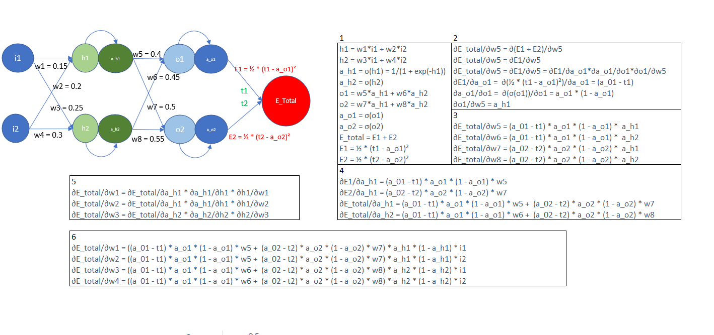
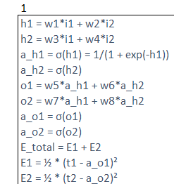
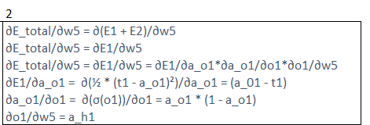
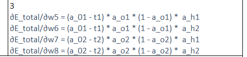
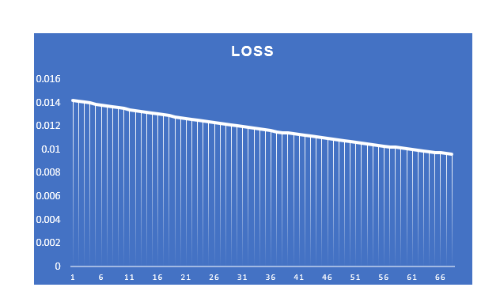
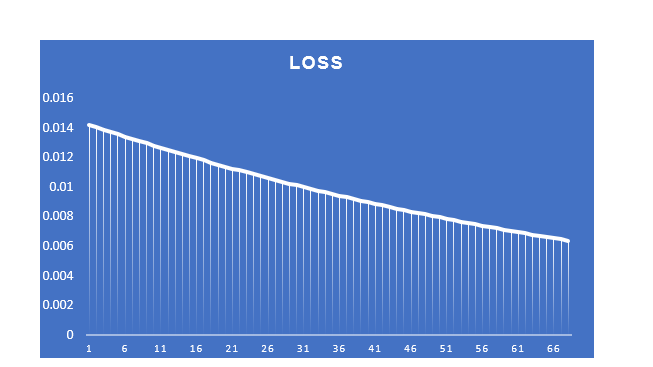
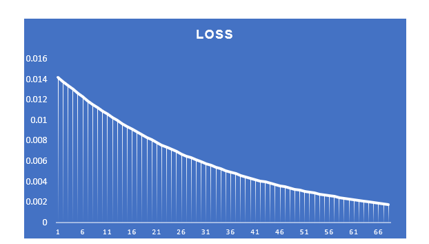
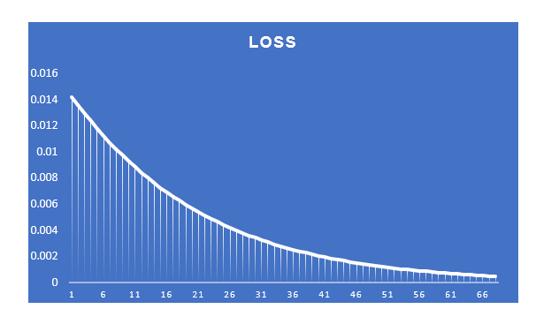
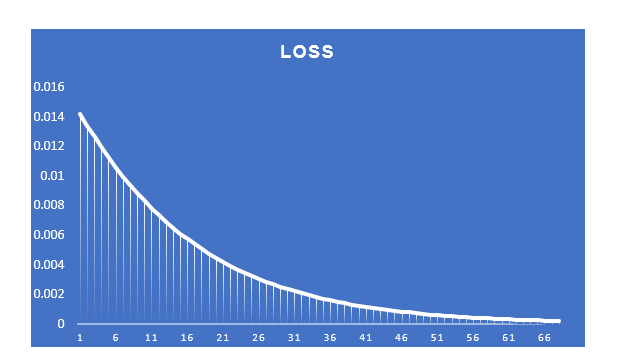
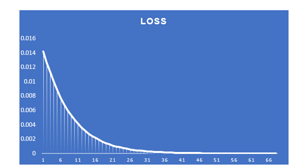

Backpropogation calculation

Step 1

1) Calculate h1 by multiplying weight 1 with input 1 + weight 2 with input 2
2) Calculate h2 by multiplying weight 3 with input 1 + weight 4  with input 2
3) Calculate a_h1 by applying sigmoid function to h1
4) Calculate a_h2 by applying sigmoid function to h2
5) Calculate o1 by multiplying weights 5 with a_h1 + weights 6 with a_h2
6) Calculate o2 by multiplying weights 7 with a_h1 + weights 8 with a_h2
7) Calculate a_o1 by applying sigmoid function to o1
8) Calculate a_o2 by applying sigmoid function to o2
9) Calculate E_total by adding E1 and E2

In Step 2, calculate derivative of E_total wrt to derivative of weight 5 by calculating the derivative of E1 and E2 wrt to weight 5. DE2 does not depend on W5

In Step 3, calculate Derivative of E_Total wrt to W5,W6,W7 and W8

Loss graph when the learning rate is set to 0.1. When epochs goes to 66, the loss decreasing speed gets reduced

Loss graph when the learning rate is set to 0.2. When epochs goes to 66, the loss is good as compared to 0.1 learning rate

Loss graph when the learning rate is set to 0.3. When epochs goes to 66, the loss is even good as compared to 0.1 and 0.2 learning rate

Loss graph when learning rate is set 0.8

Loss graph when learning rate is set 1

Loss graph when learning rate is set 2

